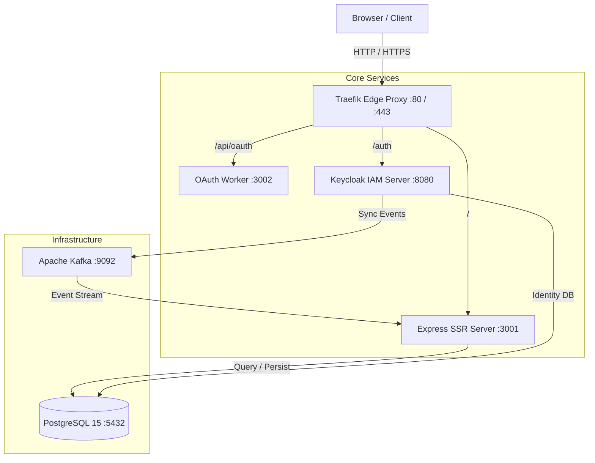

# Preempt

Preempt is a database-driven, JSON-configured virtual DOM and CMS framework built on Node.js, Express, TypeScript, PostgreSQL, Apache Kafka, Keycloak, and Traefik.

UI state, structure, styles, and handlers are defined in dynamic JSON schemas stored within PostgreSQL. This architecture allows zero-deployment UI updates, instant component distribution, and dual-mode rendering (Server-Side Rendering + Client-Side Hydration).

---

## 📐 Architecture Overview



### Key Technical Pillars
1. **Server-Side Rendering (SSR)**: Generates initial static HTML from database-stored templates and JSON components for ultra-fast initial page loads and SEO.
2. **Client-Side Hydration**: Rehydrates SSR markup into interactive stateful nodes in the client browser, running a continuous monitoring loop and processing UI handlers.
3. **Database-Driven CMS**: Components, templates, styles, and click/input handlers are stored as JSON payloads in PostgreSQL, allowing real-time schema updates without rebuilding frontend bundles.
4. **Keycloak & Event Relay**: Keycloak handles OpenID Connect (OIDC) identity. Kafka captures Keycloak auth events and streams them to the backend workers for user role synchronization.

---

## ⚡ Quickstart (Local Development)

### 1. Prerequisites
Ensure you have the following installed on your machine:
- [Docker](https://docs.docker.com/get-docker/) & [Docker Compose](https://docs.docker.com/compose/install/) (v2.0+)
- [Git](https://git-scm.com/)
- Node.js 20+ (Optional, only required if running outside Docker containers)

#### Optional: Setting Up Docker First
If Docker is not yet installed on your system, follow the steps for your operating system:

##### Linux (Ubuntu / Debian / RHEL)
Install Docker Engine & Docker Compose plugin using the official automated installer:
```bash
# Install Docker Engine & Docker Compose
curl -fsSL https://get.docker.com | sh

# Start and enable Docker service
sudo systemctl enable --now docker

# (Optional) Add your current user to the 'docker' group to run without 'sudo'
sudo usermod -aG docker $USER

# Apply group changes (or log out and log back in)
newgrp docker
```

##### macOS
Install [Docker Desktop for Mac](https://docs.docker.com/desktop/install/mac-install/) or via Homebrew:
```bash
brew install --cask docker
```

##### Windows
Install [Docker Desktop for Windows](https://docs.docker.com/desktop/install/windows-install/) (requires WSL2 enabled).

##### Verify Docker Installation
```bash
docker --version
docker compose version
```

---

### 2. Clone Repository & Setup Environment
```bash
git clone https://github.com/LittleKingsguard/Preempt.git
cd Preempt

# Copy standard environment variable configuration
cp .env.example .env
```

### 3. Launch Docker Stack
```bash
docker compose up -d --build
```

### 4. Complete Web-Based First-Time Setup
Once the containers boot up:
1. Open **`http://localhost/setup`** in your browser.
2. Log in with your initial Keycloak admin credentials (`admin` / `admin`).
3. Click **Initialize Database & Save Config**. This will automatically generate security secrets (`JWT_SECRET`, `OIDC_CLIENT_SECRET`), elevate your user to System Administrator, and seed initial JSON component libraries into PostgreSQL.

---

## 🚀 Fresh VPS Deployment Guide

For automated setup on a fresh Linux VPS (Ubuntu, Debian, RHEL, CentOS, Fedora), use the included setup bootstrapper. It automatically handles installing Docker & Docker Compose if missing:

```bash
# Download and execute the automated setup script
curl -fsSL https://raw.githubusercontent.com/LittleKingsguard/Preempt/main/setup_vps.sh | bash
```

Or clone manually on your VPS and run:
```bash
chmod +x setup_vps.sh

# Standard deployment (automatically detects & installs Docker if needed):
./setup_vps.sh

# Explicitly force Docker Engine & Compose installation first:
./setup_vps.sh --install-docker
```

### What `setup_vps.sh` Does:
1. **Docker Setup & Dependency Checks**: Detects if Docker is installed. If missing (or if `--install-docker` is passed), installs Docker Engine, `docker-compose-plugin`, enables the systemd service, and adds the active user to the `docker` group.
2. **Code Synchronization**: Clones or pulls the latest version of Preempt from GitHub.
3. **Configuration**: Prepares `.env` from `.env.example`.
4. **Stack Launch**: Runs `docker compose up -d --build` to boot all containers.
5. **Health Status**: Displays running service endpoints and steps for Web SSR initialization.

### Post-Deployment Production SSL & Domain Setup
After running `setup_vps.sh`:
1. Navigate to **`http://<YOUR_VPS_IP>/setup`** to complete first-time administrator initialization.
2. Navigate to **`http://<YOUR_VPS_IP>/setup/traefik`** to open the Production Setup Wizard:
   - **Domain Configuration**: Enter your production domain name (e.g. `app.example.com`).
   - **SSL Resolution**: Select **Let's Encrypt** (automatic TLS challenge) or **Custom SSL** (CSR & Private Key generation).
3. The wizard will output a production-ready `docker-compose.prod.yml`. Apply it on your server using:
   ```bash
   docker compose down
   cp docker-compose.prod.yml docker-compose.yml
   docker compose up -d
   ```

---

## 🌐 SSR Setup & Operational Endpoints

Preempt provides built-in web endpoints for initialization, production SSL configuration, and database management:

| Endpoint | Access Level | Description |
| :--- | :--- | :--- |
| **`/setup`** | Public / Uninitialized | First-Time Setup Wizard. Redirects automatically if no admin exists. Initializes secrets and populates component libraries. |
| **`/api/setup/initialize`** | Authenticated User | `POST` endpoint that generates `JWT_SECRET` and `OIDC_CLIENT_SECRET`, updates `.env`, elevates user roles, and seeds database schema. |
| **`/setup/traefik`** | Admin Only | Web GUI to configure production domain names and Let's Encrypt TLS / Custom SSL certificates. |
| **`/api/setup/traefik`** | Admin Only | `POST` endpoint that generates production `docker-compose.prod.yml` with port 443 HTTPS routing, HSTS headers, and cert resolvers. |
| **`/sync`** | Admin / Contributor | Reloads component and handler JSON files from `server/library/` into PostgreSQL without removing user accounts. |
| **`/revert`** | Development Mode Only | Wipes database tables, resets Keycloak client secrets to default (`admin`/`admin`), cleans `.env`, and restarts the server stack. |

---

## 🛠️ Management & Developer Helper Scripts

| Script | Path | Purpose |
| :--- | :--- | :--- |
| **VPS Installer** | [`setup_vps.sh`](file:///media/ryan/Shared%20Files1/Projects/Preempt/setup_vps.sh) | Automates installation of dependencies (including Docker Engine), Git pulling, `.env` setup, and container booting on a fresh VPS. |
| **Frontend Rebuilder** | [`rebuild_frontend.sh`](file:///media/ryan/Shared%20Files1/Projects/Preempt/rebuild_frontend.sh) | Clears Vite bundle cache and rebuilds client TypeScript artifacts inside a temporary Node Docker container. |
| **Database Reset** | [`reset_db.sh`](file:///media/ryan/Shared%20Files1/Projects/Preempt/reset_db.sh) | Restores PostgreSQL database back to the captured state defined in `server/seed.sql`. |

---

## 🔌 System Ports Allocation

| Service | Container Name | Host Port | Internal Port | Protocol / Path |
| :--- | :--- | :--- | :--- | :--- |
| **Traefik Proxy** | `preempt_traefik` | **`80`** | `80` | HTTP / Web Traffic |
| **Traefik Dashboard** | `preempt_traefik` | **`8080`** | `8080` | Admin Dashboard |
| **Express Backend** | `preempt_backend` | **`3001`** | `3001` | SSR & API Engine |
| **OAuth Worker** | `preempt_backend` | **`3002`** | `3002` | OAuth Callback |
| **PostgreSQL DB** | `preempt_postgres` | **`5432`** | `5432` | Database Storage |
| **Apache Kafka** | `preempt_kafka` | **`9092`** | `9092` | Event Streaming |
| **Keycloak IAM** | `preempt_keycloak` | Internal | `8080` | Realm `/auth` |

---

## 🔑 Environment Variables Reference

Reference table for variables defined in [`.env.example`](file:///media/ryan/Shared%20Files1/Projects/Preempt/.env.example):

| Variable | Default Value | Description |
| :--- | :--- | :--- |
| `PGUSER` | `preempt` | PostgreSQL database user account |
| `PGPASSWORD` | `preemptpassword` | PostgreSQL database user password |
| `PGDATABASE` | `preempt` | PostgreSQL database name |
| `PGHOST` | `localhost` | Database host connection string |
| `PGPORT` | `5432` | Database host port |
| `PORT` | `3001` | Primary Express backend HTTP server port |
| `OAUTH_PORT` | `3002` | OAuth callback server port |
| `JWT_SECRET` | `supersecretkey` | Secret key for signing internal JSON Web Tokens |
| `OIDC_ISSUER` | `http://localhost/auth/realms/preempt` | Keycloak OpenID Connect issuer URL |
| `OIDC_CLIENT_ID` | `preempt-app` | Keycloak client ID for authentication |
| `OIDC_CLIENT_SECRET` | `secret` | Keycloak client secret key |
| `OIDC_REDIRECT_URI` | `http://localhost/api/oauth/callback` | OAuth authentication redirect callback |
| `KEYCLOAK_ADMIN` | `admin` | Initial Keycloak master realm administrator username |
| `KEYCLOAK_ADMIN_PASSWORD` | `admin` | Initial Keycloak master realm administrator password |
| `KAFKA_BROKERS` | `kafka:9092` | Kafka broker host and port address |
| `LOG_LEVEL` | `info` | Pino logger logging level (`debug`, `info`, `warn`, `error`) |

---

## 📄 License

This project is licensed under the terms of the MIT License. See [LICENSE](file:///media/ryan/Shared%20Files1/Projects/Preempt/LICENSE) for details.
